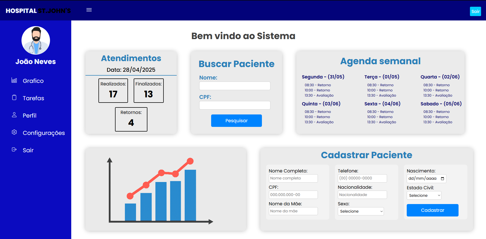
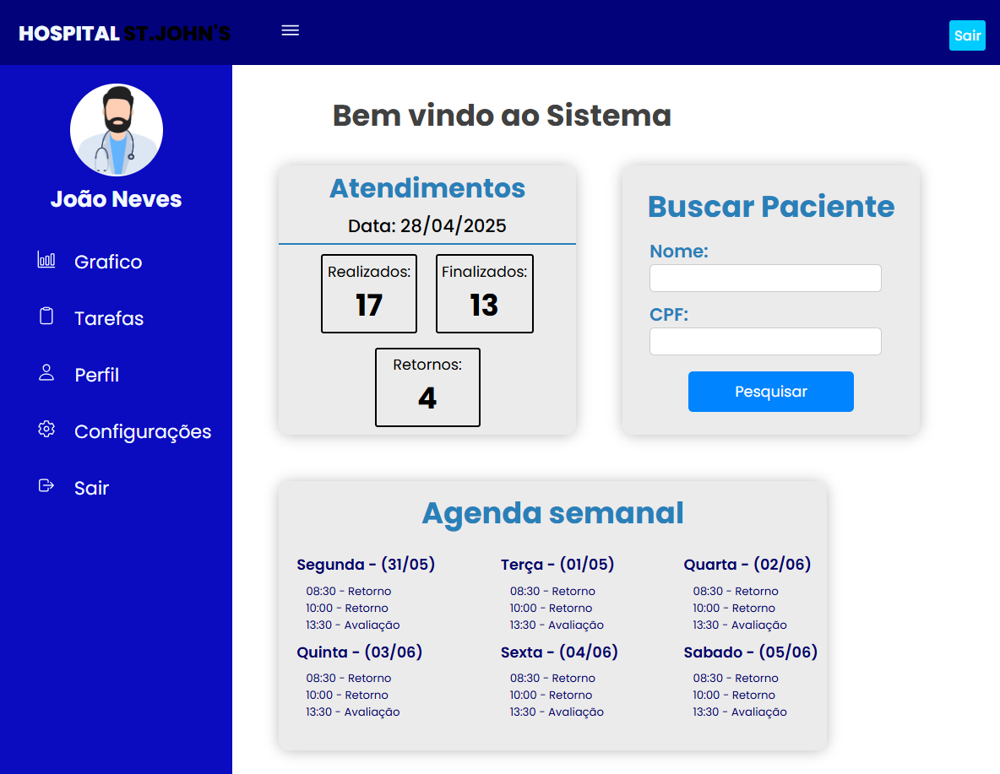

# 🏥 Sistema Hospitalar Responsivo

Este projeto simula um sistema de gerenciamento hospitalar desenvolvido com foco em responsividade e organização visual.  
Baseia-se em outro sistema que estou desenvolvendo no trabalho, criado em **FlutterFlow**.

## 🔧 Tecnologias utilizadas

- HTML5
- CSS3
- Layout responsivo (tablet/desktop)

## 🎯 Funcionalidades

- Tela de login simulada
- Formulário de cadastro de pacientes
- Tabela de dados (simulada)
- Layout adaptável para diferentes tamanhos de tela
- Dados de atendimento diário
- Pesquisa de pacientes
- Gráfico ilustrativo

## 📸 Demonstração

### 💻 Desktop

### 📱 Tablet

## 🚀 Como visualizar

**Online:**  
🔗 [https://luizlucro.github.io/sistema-hospitalar](https://luizlucro.github.io/sistema-hospitalar)

**Local:**

1. Clone o repositório
2. Abra `index.html` no navegador

## 📁 Estrutura de Pastas

PROJETIHOSPITAL HTML&CSS/
├── img/
│ ├── imageDesktop.png
│ └── imageTablet.png
├── ProjetoHospital/
│ ├── index.html
│ ├── principal.html
│ ├── style.css
│ └── style2.css
├── README.md

## 👨‍💻 Autor

Desenvolvido por **Luiz Phelipe Alves Ferreira**

- LinkedIn: [linkedin.com/in/luiz-phelipe-80a1932b0](www.linkedin.com/in/luiz-phelipe-80a1932b0)
- GitHub: [github.com/luizlucro](https://github.com/luizphelipe02)
